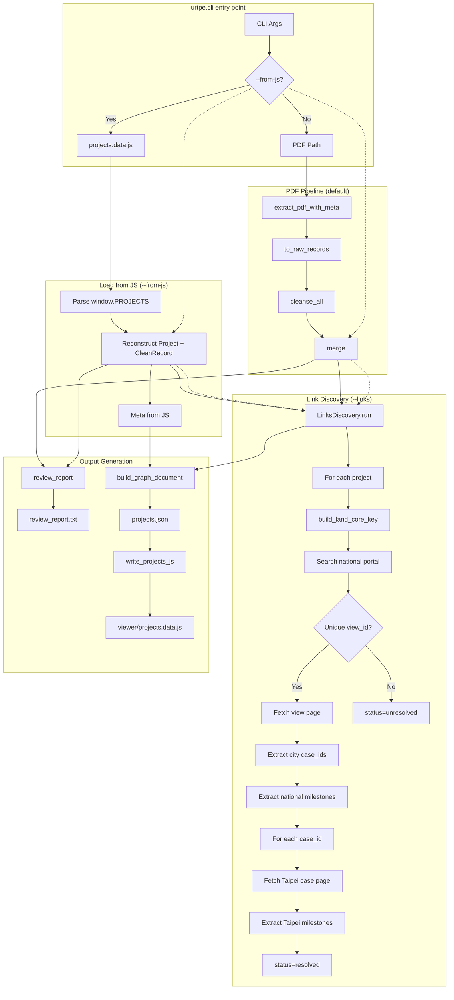

# urtpe.cli Flow

> **ARCHIVED (2026-08-24) — superseded by [`cli_flow_v2.md`](cli_flow_v2.md).**
> Kept for history only; do not follow this diagram. It describes the original
> link-discovery order (search the national portal → fetch `view/<id>` → scrape
> Taipei case pages as HTML). The implementation is now **Taipei-first** over the
> `*.ashx` JSON APIs, with a `portal_index.json` bulk index and a per-project
> `result.json` cache, and gained `--fresh` / `--playwright` /
> `--add-mapping-file` plus the `resolved_no_city` status. See
> `cli_flow_v2.md` for the current flow and `cli_flow_v2.md` §"Key differences
> from v1" for the delta.

