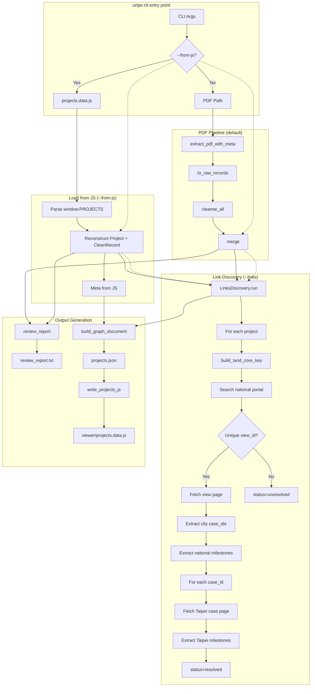

# urtpe.cli Flow

```mermaid
flowchart TD
    subgraph CLI["urtpe.cli entry point"]
        A[CLI Args] --> B{--from-js?}
        B -->|No| C[PDF Path]
        B -->|Yes| D[projects.data.js]
    end

    subgraph PDF_PIPELINE["PDF Pipeline (default)"]
        C --> E[extract_pdf_with_meta]
        E --> F[to_raw_records]
        F --> G[cleanse_all]
        G --> H[merge]
    end

    subgraph JS_LOAD["Load from JS (--from-js)"]
        D --> I[Parse window.PROJECTS]
        I --> J[Reconstruct Project + CleanRecord]
        J --> K[Meta from JS]
    end

    subgraph LINKS["Link Discovery (--links)"]
        H --> L[LinksDiscovery.run]
        J --> L
        L --> M[For each project]
        M --> N[build_land_core_key]
        N --> O[Search national portal]
        O --> P{Unique view_id?}
        P -->|Yes| Q[Fetch view page]
        P -->|No| R[status=unresolved]
        Q --> S[Extract city case_ids]
        S --> T[Extract national milestones]
        T --> U[For each case_id]
        U --> V[Fetch Taipei case page]
        V --> W[Extract Taipei milestones]
        W --> X[status=resolved]
    end

    subgraph OUTPUT["Output Generation"]
        H --> Y[review_report]
        J --> Y
        L --> Z[build_graph_document]
        K --> Z
        Y --> AA[review_report.txt]
        Z --> BB[projects.json]
        BB --> CC[write_projects_js]
        CC --> DD[viewer/projects.data.js]
    end

    %% Connections
    B -.-> H
    B -.-> J
    H -.-> L
    J -.-> L
```