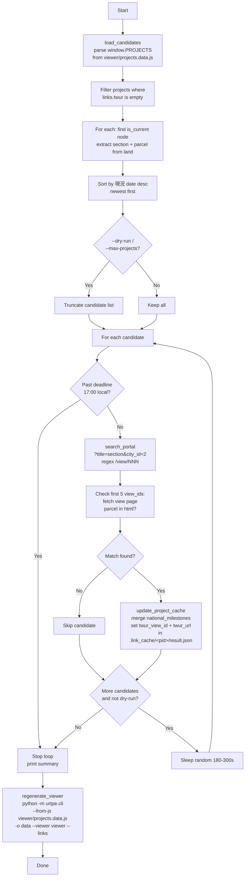

# urtpe.cli Flow (v2)

Updated for the current implementation: Taipei-first link discovery via the
platform's JSON API, portal bulk index with resume cache, per-project result
caching, and new CLI flags (`--playwright`, `--fresh`, `--add-mapping-file`).

```mermaid
flowchart TD
    subgraph CLI["urtpe.cli entry point"]
        A[Parse CLI args] --> B{--add-mapping-file?}
        B -->|Yes| M[add_fallback_mapping<br/>update data/taipei_case_ids.json<br/>write add_mapping.log]
        M --> M2[return 0]
        B -->|No| C{--from-js?}
        C -->|No| D[PDF Path]
        C -->|Yes| E[projects.data.js]
    end

    subgraph PDF_PIPELINE["PDF Pipeline (default)"]
        D --> F[extract_pdf_with_meta]
        F --> G[to_raw_records]
        G --> H[cleanse_all]
        H --> I[merge]
        I --> P1[Projects + meta<br/>published_date from PDF]
    end

    subgraph JS_LOAD["Load from JS (--from-js)"]
        E --> J[_load_projects_from_js<br/>reconstruct Project + CleanRecord]
        J --> P2[Projects + meta from JS<br/>skip extract/cleanse/merge]
    end

    subgraph LINKS["Link Discovery (--links, Taipei-first)"]
        P1 --> K{--links?}
        P2 --> K
        K -->|No| K1[link_results = empty]
        K -->|Yes| L[LinksDiscovery.run<br/>cache_dir=outdir/.link_cache]
        L --> L1{--fresh?}
        L1 -->|Yes| L2[wipe cache dir]
        L1 -->|No| L3[build_portal_index<br/>crawl national portal list pages<br/>cached as portal_index.json]
        L2 --> L3
        L3 --> L4[For each project<br/>sorted by project_id]
        L4 --> N[build_land_core_key<br/>from anchor record]
        N --> O{per-project cache<br/>result.json hit?}
        O -->|Yes| O1[reuse cached DiscoveryResult]
        O -->|No| Q[Step 1: Taipei JSON API search<br/>Get_updcase_list.ashx<br/>by section + first_parcel]
        Q --> R[Step 2: for each case_id<br/>Get_project168_second.ashx<br/>milestones via STAGE_FIELD_MAP]
        R --> S[Step 3 supplementary:<br/>lookup land_core in portal_index<br/>fallback data/taipei_case_ids.json]
        S --> T{view_id found?}
        T -->|Yes| U[fetch national view page<br/>extract 推動歷程]
        T -->|No| V[skip national milestones]
        U --> W{status}
        V --> W
        W -->|city_ids + milestones| X[resolved]
        W -->|city_ids only| Y[resolved_no_city]
        W -->|no city_ids| Z[unresolved]
        X --> AA[save project cache]
        Y --> AA
        Z --> AA
        O1 --> AB
        AA --> AB[write_crawl_log<br/>crawl_log.tsv + stats printed]
    end

    subgraph OUTPUT["Output Generation"]
        AB --> BB[review_report]
        K1 --> BB
        BB --> BC[review_report.txt]
        BB --> BD[build_graph_document<br/>attach_links_to_projects]
        BD --> BE[projects.json]
        BE --> BF{--viewer DIR?}
        BF -->|Yes| BG[write_projects_js<br/>viewer/projects.data.js]
        BE --> BH{--no-tsv or --from-js?}
        BH -->|No| BI[raw.tsv / clean.tsv / merged.tsv]
    end
```



## CLI options (`main`)

| Flag | Effect |
| --- | --- |
| `pdf` (positional, optional) | Source PDF; required unless `--from-js` |
| `-o, --outdir` | Output directory (default `data`) |
| `--no-tsv` | Skip TSV outputs, JSON graph only |
| `--viewer DIR` | Also write `DIR/projects.data.js` |
| `--links` | Enable official link discovery (fallback JSON mapping, recommended) |
| `--playwright` | Use Playwright-based link discovery (experimental) |
| `--fresh` | Force re-crawl of portal index and cached pages; wipes `.link_cache` |
| `--from-js PATH` | Load projects from existing `projects.data.js`, skip PDF parsing |
| `--add-mapping-file PATH` | Early-exit: add fallback mapping `{land_core, view_id, case_id}` to `data/taipei_case_ids.json` and return |

## Link discovery detail

- **Portal bulk index**: `build_portal_index` paginates the national portal
  list (`city_id=2`, `?page=N`), parses title into a land core
  (`parse_name_id`), and persists `portal_index.json` in the cache dir for
  resume; `--fresh` rebuilds it.
- **Per-project cache**: each project's `DiscoveryResult` is cached at
  `.link_cache/<project_id>/result.json` (plus `view.html`), so re-runs only
  fetch missing projects.
- **Taipei-first**: search + milestones come from the Taipei platform's ashx
  JSON API (`Get_updcase_list.ashx`, `Get_project168_second.ashx`); only
  r_progress_detail cases with numeric case_ids are kept. The national portal
  view page is fetched only to supply the `twur_url` and 推動歷程 milestones.
- **Status values**: `resolved` (city case ids + Taipei milestones),
  `resolved_no_city` (ids but no milestones), `unresolved` (no ids); network
  failures set `error` without aborting the run.
- All HTTP fetches use browser-like headers, retry with exponential backoff,
  and transparent gzip/deflate decoding (`fetch_url`, `_post_taipei_api`).

## Key differences from v1

1. Discovery order inverted: Taipei JSON API first, national portal
   supplementary (v1 searched the national portal first and scraped Taipei
   case pages as HTML).
2. Portal bulk index with `portal_index.json` resume cache replaces
   per-project national portal searches.
3. Per-project result caching; `--fresh` wipes the whole cache.
4. New statuses `resolved_no_city` (v1 had `unresolved`/`resolved`/`error`
   only).
5. `crawl_log.tsv` written to outdir; `--add-mapping-file` early-exit mode.
6. `--from-js` now also suppresses TSV outputs (raw/clean/merged come from the
   PDF pipeline only).

## Companion script: `scripts/fetch_remaining_national_portal.py`

Time-bounded backfill for projects still missing `twur` links after a normal
run. It writes into the same `.link_cache` per-project cache the CLI reads, so
its results are picked up on the next `--links` run.

Usage:

```
python scripts/fetch_remaining_national_portal.py [--dry-run] [--max-projects N]
```



Details:

- **Candidates**: projects in `viewer/projects.data.js` whose `links.twur` is
  empty and whose anchor (`is_current`) node yields both a `section` and a
  first parcel parsed from the `land` string (`(\d+(?:-\d+)?)地號`), sorted by
  current date descending.
- **Matching**: searches the national portal by section title, then checks at
  most the first 5 view pages, accepting the first whose HTML contains the
  parcel (also tried with `-` replaced by `、`).
- **Cache update**: merges new `national_milestones` over existing ones (new
  wins on overlap) and sets `twur_view_id`/`twur_url` in the per-project
  `result.json`; projects without an existing cache entry are skipped.
- **Politeness / deadline**: sleeps a random 180–300 s between projects
  (skipped in dry-run and after the last one) and stops at 17:00 local time
  (`DEADLINE_HOUR=17`), finishing the current fetch first.
- **Viewer regeneration**: on completion runs the CLI in `--from-js --links
  --viewer viewer` mode as a subprocess so `projects.data.js` reflects the
  backfilled links. Failed cache updates are counted in the summary;
  `log_failure` (appending JSON Lines to
  `data/.link_cache/fetch_failures.json`) exists but is not currently wired
  into `main`.
