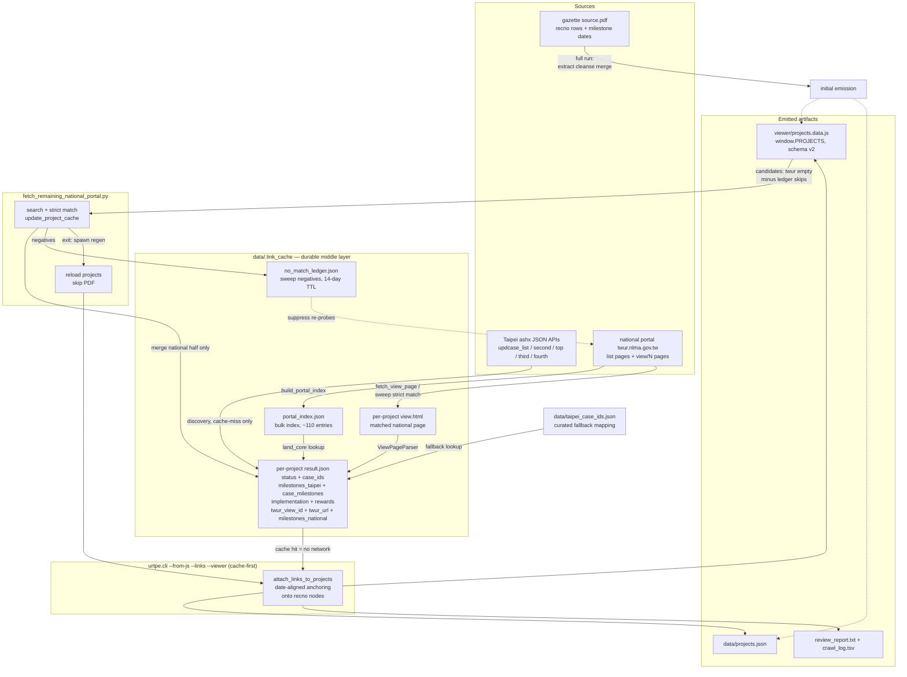

# urtpe.cli Flow (v2)

Updated for the current implementation: Taipei-first link discovery via the
platform's JSON API, portal bulk index with resume cache, per-project result
caching, and new CLI flags (`--playwright`, `--fresh`, `--add-mapping-file`).

```mermaid
flowchart TD
    subgraph CLI["urtpe.cli entry point"]
        A[Parse CLI args] --> B{--add-mapping-file?}
        B -->|Yes| M[add_fallback_mapping<br/>update data/taipei_case_ids.json<br/>write add_mapping.log]
        M --> M2[return 0]
        B -->|No| C{--from-js?}
        C -->|No| D[PDF Path]
        C -->|Yes| E[projects.data.js]
    end

    subgraph PDF_PIPELINE["PDF Pipeline (default)"]
        D --> F[extract_pdf_with_meta]
        F --> G[to_raw_records]
        G --> H[cleanse_all]
        H --> I[merge]
        I --> P1[Projects + meta<br/>published_date from PDF]
    end

    subgraph JS_LOAD["Load from JS (--from-js)"]
        E --> J[_load_projects_from_js<br/>reconstruct Project + CleanRecord]
        J --> P2[Projects + meta from JS<br/>skip extract/cleanse/merge]
    end

    subgraph LINKS["Link Discovery (--links, Taipei-first)"]
        P1 --> K{--links?}
        P2 --> K
        K -->|No| K1[link_results = empty]
        K -->|Yes| L[LinksDiscovery.run<br/>cache_dir=outdir/.link_cache]
        L --> L1{--fresh?}
        L1 -->|Yes| L2[wipe cache dir]
        L1 -->|No| L3[build_portal_index<br/>crawl national portal list pages<br/>cached as portal_index.json]
        L2 --> L3
        L3 --> L4[For each project<br/>sorted by project_id]
        L4 --> N[build_land_core_key<br/>from anchor record]
        N --> O{per-project cache<br/>result.json hit?}
        O -->|Yes| O1[reuse cached DiscoveryResult]
        O -->|No| Q[Step 1: Taipei JSON API search<br/>Get_updcase_list.ashx<br/>by section + first_parcel]
        Q --> R[Step 2: for each case_id<br/>Get_project168_second.ashx<br/>milestones via STAGE_FIELD_MAP]
        R --> S[Step 3 supplementary:<br/>lookup land_core in portal_index<br/>fallback data/taipei_case_ids.json]
        S --> T{view_id found?}
        T -->|Yes| U[fetch national view page<br/>extract 推動歷程]
        T -->|No| V[skip national milestones]
        U --> W{status}
        V --> W
        W -->|city_ids + milestones| X[resolved]
        W -->|city_ids only| Y[resolved_no_city]
        W -->|no city_ids| Z[unresolved]
        X --> AA[save project cache]
        Y --> AA
        Z --> AA
        O1 --> AB
        AA --> AB[write_crawl_log<br/>crawl_log.tsv + stats printed]
    end

    subgraph OUTPUT["Output Generation"]
        AB --> BB[review_report]
        K1 --> BB
        BB --> BC[review_report.txt]
        BB --> BD[build_graph_document<br/>attach_links_to_projects]
        BD --> BE[projects.json]
        BE --> BF{--viewer DIR?}
        BF -->|Yes| BG[write_projects_js<br/>viewer/projects.data.js]
        BE --> BH{--no-tsv or --from-js?}
        BH -->|No| BI[raw.tsv / clean.tsv / merged.tsv]
    end
```



## CLI options (`main`)

| Flag | Effect |
| --- | --- |
| `pdf` (positional, optional) | Source PDF; required unless `--from-js` |
| `-o, --outdir` | Output directory (default `data`) |
| `--no-tsv` | Skip TSV outputs, JSON graph only |
| `--viewer DIR` | Also write `DIR/projects.data.js` |
| `--links` | Enable official link discovery (fallback JSON mapping, recommended) |
| `--playwright` | Use Playwright-based link discovery (experimental) |
| `--fresh` | Force re-crawl of portal index and cached pages; wipes `.link_cache` |
| `--from-js PATH` | Load projects from existing `projects.data.js`, skip PDF parsing |
| `--add-mapping-file PATH` | Early-exit: add fallback mapping `{land_core, view_id, case_id}` to `data/taipei_case_ids.json` and return |

## Link discovery detail

- **Portal bulk index**: `build_portal_index` paginates the national portal
  list (`city_id=2`, `?page=N`), parses title into a land core
  (`parse_name_id`), and persists `portal_index.json` in the cache dir for
  resume; `--fresh` rebuilds it.
- **Per-project cache**: each project's `DiscoveryResult` is cached at
  `.link_cache/<project_id>/result.json` (plus `view.html`), so re-runs only
  fetch missing projects.
- **Taipei-first**: search + milestones come from the Taipei platform's ashx
  JSON API (`Get_updcase_list.ashx`, `Get_project168_second.ashx`); only
  r_progress_detail cases with numeric case_ids are kept. The national portal
  view page is fetched only to supply the `twur_url` and 推動歷程 milestones.
- **Status values**: `resolved` (city case ids + Taipei milestones),
  `resolved_no_city` (ids but no milestones), `unresolved` (no ids); network
  failures set `error` without aborting the run.
- All HTTP fetches use browser-like headers, retry with exponential backoff,
  and transparent gzip/deflate decoding (`fetch_url`, `_post_taipei_api`).

## Key differences from v1

1. Discovery order inverted: Taipei JSON API first, national portal
   supplementary (v1 searched the national portal first and scraped Taipei
   case pages as HTML).
2. Portal bulk index with `portal_index.json` resume cache replaces
   per-project national portal searches.
3. Per-project result caching; `--fresh` wipes the whole cache.
4. New statuses `resolved_no_city` (v1 had `unresolved`/`resolved`/`error`
   only).
5. `crawl_log.tsv` written to outdir; `--add-mapping-file` early-exit mode.
6. `--from-js` now also suppresses TSV outputs (raw/clean/merged come from the
   PDF pipeline only).

## Companion script: `scripts/fetch_remaining_national_portal.py`

Time-bounded backfill for projects still missing `twur` links after a normal
run. It writes into the same `.link_cache` per-project cache the CLI reads, so
its results are picked up on the next `--links` run.

Usage:

```
python scripts/fetch_remaining_national_portal.py [--dry-run] [--max-projects N]
```

```mermaid
flowchart TD
    S0[Start] --> S1[load_candidates<br/>parse window.PROJECTS<br/>from viewer/projects.data.js]
    S1 --> S2[Filter projects where<br/>links.twur is empty]
    S2 --> S3[For each: find is_current node<br/>extract section + parcel from land]
    S3 --> S4[Sort by 現況 date desc<br/>newest first]
    S4 --> S5{--dry-run /<br/>--max-projects?}
    S5 -->|Yes| S6[Truncate candidate list]
    S5 -->|No| S7[Keep all]
    S6 --> S8[For each candidate]
    S7 --> S8
    S8 -->     S9{Past deadline?<br/>DEADLINE_HOUR/MINUTE<br/>wrapper-overridable}
    S9 -->|Yes| S15[Stop loop<br/>print summary]
    S9 -->|No| S10[search_portal<br/>?title=section&city_id=2<br/>regex /view/NNN]
    S10 --> S11[Probe up to --max-probe 8<br/>strict section+parcel+count match]
    S11 --> S12{Match found?}
    S12 -->|No| S13[record_no_match to<br/>no_match_ledger.json]
    S12 -->|Yes| S14[update_project_cache<br/>merge national_milestones<br/>set twur_view_id + twur_url<br/>in .link_cache/&lt;pid&gt;/result.json]
    S13 --> S16{More candidates<br/>and not dry-run?}
    S14 --> S16
    S16 -->|Yes|     S17[Sleep 15-45s skip<br/>60-180s match]
    S17 --> S8
    S16 -->|No| S15
    S15 --> S18[regenerate_viewer<br/>python -m urtpe.cli<br/>--from-js viewer/projects.data.js<br/>-o data --viewer viewer --links]
    S18 --> S19[Done]
```

Details:

- **Candidates**: projects in `viewer/projects.data.js` whose `links.twur` is
  empty and whose anchor (`is_current`) node yields both a `section` and a
  first parcel parsed from the `land` string (`(\d+(?:-\d+)?)地號`), sorted by
  current date descending.
- **Matching**: searches the national portal by section title, then probes up
  to `--max-probe` (default 8) view pages, accepting the first that passes
  `view_page_matches` — strict `<parcel>地號` body check + parsed-title
  section/parcel/count equality (post `fix-targeted-portal-matcher`; see
  facts §16.1 for the two defects this replaced).
- **No-match ledger**: every negative is recorded to
  `data/.link_cache/no_match_ledger.json` (atomic write, corrupt-file
  quarantine) and candidates probed within `--reprobe-days` (default 14,
  `0` disables skipping) are excluded at load; entries clear on match and a
  run-start sweep drops projects that gained twur elsewhere.
- **Cache update**: merges new `national_milestones` over existing ones (new
  wins on overlap) and sets `twur_view_id`/`twur_url` in the per-project
  `result.json`; projects without an existing cache entry are skipped.
- **Politeness / deadline**: sleeps 60–180 s after matches and 15–45 s after
  skips (both bypassed in dry-run and after the last candidate) and stops at
  the deadline pair `DEADLINE_HOUR`/`DEADLINE_MINUTE` (default 07:00),
  finishing the current fetch first. Deadline resolution rolls to tomorrow
  when already past at launch (`_next_deadline`), so cross-midnight targets —
  e.g. `python scripts/run_sweep_until.py 6 0` — work; see facts §16 run log.
- **Viewer regeneration**: on completion runs the CLI in `--from-js --links
  --viewer viewer` mode as a subprocess so `projects.data.js` reflects the
  backfilled links. Failed cache updates are counted in the summary;
  `log_failure` (appending JSON Lines to
  `data/.link_cache/fetch_failures.json`) exists but is not currently wired
  into `main`.

> **Stale-diagram note (2026-08-26)**: the flowchart above predates the
> no-match ledger, the strict matcher (`fix-targeted-portal-matcher`, §16.1 in
> `docs/facts_2_portals.md`), and the deadline-overriding wrapper
> `scripts/run_sweep_until.py HH MM`. Current truth: probe up to
> `--max-probe` (default 8) pages with strict section+parcel+count match,
> record negatives in `no_match_ledger.json`, sleep 60–180 s (match) /
> 15–45 s (skip), default deadline 07:00 (wrapper overrides).

## Data flow — where data lives

Correct mental model: the PDF is parsed only on full runs; routine
regenerations rebuild from `viewer/projects.data.js` plus the per-project
caches and hit the network only on cache misses. Both portals' results share
one cache file per project.



Reading the diagram:

- **`result.json` is the single source both writers converge on**: CLI
  discovery fills the Taipei half (+ national when the portal index resolves a
  view_id); the sweep merges only the national half. Whoever runs second must
  respect the single-writer rule (facts §17).
- **`viewer/projects.data.js` is both input and output** of regeneration:
  `--from-js` loads it, discovery/cache refresh the link layers, and the CLI
  rewrites it with links anchored onto recno nodes. That is why a bad emission
  can propagate (load → save round-trip) — treat it as state, not scratch.
- **Network is exceptional during regen**: any `<project>/result.json` hit
  means zero HTTP calls for that project. Live calls happen only on cache
  misses (new/corrupt projects) or inside sweeps.
- **`portal_index.json` covers only ~110 newest entries** (WAF-capped crawl);
  everything older reached the cache via sweeps, so deleting per-project
  caches cannot be healed from the index alone — see facts §18 before any
  destructive job.
