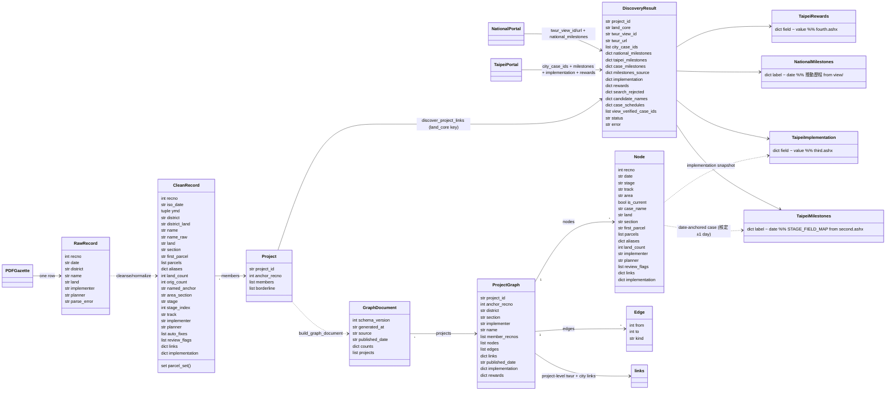

# Domain Model

## Notes

- **PDF** is the family skeleton and the heartbeat: one `RawRecord` per gazette row → one `CleanRecord` per node. `recno` is the only cross-PDF stable key (gazette renumbers every session).
- **Join identity** is the land core `{district}{section}{first_parcel}地號等{count}筆` (`build_land_core_key`), shared by merge and both portals.
- **Taipei** is pre-approval depth: per-`case_id` timelines (`case_milestones`), merged last-write-wins into `taipei_milestones` with provenance in `milestones_source`, plus `implementation` (`third.ashx`) and `rewards` (`fourth.ashx`).
- **National** is post-approval breadth: one `view/<id>` per project (revision rollup), `national_milestones` (推動歷程 incl. 使用核發, the only occupancy source).
- **Node anchoring** matches the node's date to a case's 核定日期/權變核定日期 exact-then-±1-day; per-record `implementation` snapshots ride onto nodes.
- **Two newer `DiscoveryResult` fields** (added after this diagram was first drawn): `case_schedules` — per-case state (已核准/已駁回/自行撤回/已失效/審查中/施工中) explaining why a project whose cases were all rejected has no national-portal page (§6.14); `view_verified_case_ids` — case_ids read off the project's *own* national view page 相關連結, portal-verified and therefore exempt from the landcore-similarity gate (§6.14 ghost creation).
- Sources: `urtpe/models.py`, `urtpe/graph.py`, `urtpe/links.py`, `openspec/specs/official-link-discovery/spec.md`.