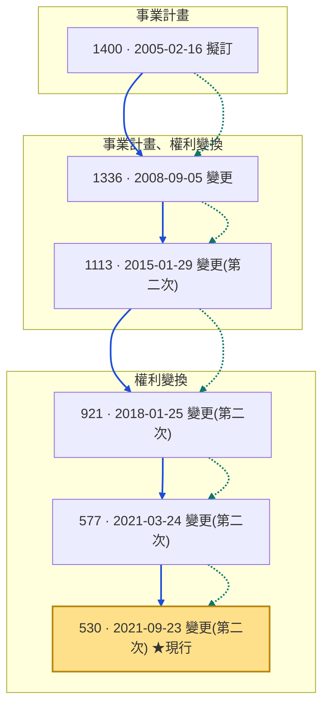

# 信義區-永吉段四小段-44地號等26筆

- 案名：變更(第二次)臺北市信義區永吉段四小段44地號等26筆土地都市更新權利變換計畫(變更釐正圖冊)案
- 實施者：森業營造股份有限公司（前身：萬宇開發股份有限公司）
- 計畫區土地：臺北市信義區永吉段四小段 44、44-1～44-17、44-19、44-20、44-21、45～49 地號等 26 筆
- 資料統計：統計至 115年8月11日

## 案件歷程圖

節點為計畫紀錄（由新到舊），實線 = `revision` 邊，虛線 = `track` 邊，金色節點 = 現行（is_current）紀錄。

```mermaid
flowchart LR
    R530["#530 2021-09-23<br/>變更(第二次)・權利變換 ★現行<br/>變更(第二次)…權利變換計畫(變更釐正圖冊)案"]
    R577["#577 2021-03-24<br/>變更(第二次)・權利變換<br/>變更(第二次)…權利變換計畫案"]
    R921["#921 2018-01-25<br/>變更(第二次)・權利變換<br/>變更(第二次)…都市更新事業及變更權利變換計畫案"]
    R1113["#1113 2015-01-29<br/>變更(第二次)・事業計畫、權利變換<br/>變更(第二次)…事業計畫及變更權利變換計畫案"]
    R1336["#1336 2008-09-05<br/>變更・事業計畫、權利變換<br/>變更…事業計畫及擬訂權利變換計畫案"]
    R1400["#1400 2005-02-16<br/>擬訂・事業計畫<br/>擬訂…土地都市更新事業計畫案"]

    R530 -->|revision| R577
    R577 -->|revision| R921
    R921 -->|revision| R1113
    R1113 -->|revision| R1336
    R1336 -->|revision| R1400

    R530 -.->|track| R577
    R577 -.->|track| R921
    R921 -.->|track| R1113
    R1113 -.->|track| R1336
    R1336 -.->|track| R1400

    classDef current fill:#ffe08a,stroke:#b8860b,stroke-width:2px
    class R530 current
```

## 節點明細

| recno | 日期 | 階段 | 軌道 | 現行 | 案名 | 實施者 | 規劃者 |
| --- | --- | --- | --- | --- | --- | --- | --- |
| 530 | 2021-09-23 | 變更(第二次) | 權利變換 | ✔ | 變更(第二次)臺北市信義區永吉段四小段44地號等26筆土地都市更新權利變換計畫(變更釐正圖冊)案 | 森業營造股份有限公司 | 梁正芳建築師事務所 |
| 577 | 2021-03-24 | 變更(第二次) | 權利變換 | | 變更(第二次)臺北市信義區永吉段四小段44地號等26筆土地都市更新權利變換計畫案 | 森業營造股份有限公司 | 梁正芳建築師事務所 |
| 921 | 2018-01-25 | 變更(第二次) | 權利變換 | | 變更(第二次)臺北市信義區永吉段四小段44地號等26筆土地都市更新事業及變更權利變換計畫案 | 森業營造股份有限公司 | 梁正芳建築師事務所 |
| 1113 | 2015-01-29 | 變更(第二次) | 事業計畫、權利變換 | | 變更(第二次)臺北市信義區永吉段四小段44地號等26筆土地都市更新事業計畫及變更權利變換計畫案 | 森業營造股份有限公司 | 梁正芳建築師事務所 |
| 1336 | 2008-09-05 | 變更 | 事業計畫、權利變換 | | 變更臺北市信義區永吉段四小段44地號等26筆土地都市更新事業計畫及擬訂權利變換計畫案 | 萬宇開發股份有限公司 | 梁正芳建築師事務所 |
| 1400 | 2005-02-16 | 擬訂 | 事業計畫 | | 擬訂臺北市信義區永吉段四小段44地號等26筆土地都市更新事業計畫案 | 萬宇開發股份有限公司 | 梁正芳建築師事務所 |

## 里程碑

| 項目 | 日期 |
| --- | --- |
| 公告公展日期 | 2003/05/16 |
| 召開幹事會日期 | 2003/07/04 |
| 公展公聽會日期 | 2003/06/09 |
| 概要公聽會日期 | 2006/08/19 |
| 概要審議會通過日期 | 2004/09/17 |
| 申請概要日期 | 2006/09/19 |
| 核定日期 | 2005/02/16 |
| 審議會審議通過日期 | 2004/09/17 |
| 計畫公聽會日期 | 2006/11/04 |
| 申請計畫日期 | 2006/11/06 |
| 權變公聽會日期 | 2013/02/26 |
| 權變公告公展日期 | 2013/08/26 |
| 權變公展公聽會日期 | 2013/09/12 |
| 申請幹事會日期 / 權變申請幹事會日期 | 2013/11/07 |
| 權變召開幹事會日期 | 2013/11/07 |
| 召開聽證日期 / 權變召開聽證日期 | 2014/07/25 |
| 申請聽證日期 / 權變申請聽證日期 | 2014/05/22 |
| 申請核定日期 | 2014/11/21 |
| 建照核發日期 | 2018/02/06 |
| 權變申請核定日期 / 申請權變日期 | 2021/09/13 |
| 權變核定日期 | 2021/09/23 |
| 權變審議會審議通過日期 | 2021/11/12 |

## 相關連結

- 臺北市都更案件編號：09511041、09501142、08911251、09501143、09501144、09508190

## 附錄：檢視器上方圖表的 Mermaid 重現

檢視器點開案件後最上方的圖（`viewer/app.js` 的 `renderDetail`）是一張泳道時間軸：

- 縱軸＝時間：紀錄依核定日期由舊到新、由上到下排列
- 橫軸＝事業軌道欄位：左＝事業計畫／概要、中＝事業計畫＋權利變換、右＝權利變換（`trackPosition()`）
- 藍實線＝版本（`revision`，核定時序）、綠虛線＝事業種類（`track`）；兩者在檢視器中繪於相同的相鄰節點對之間（線段重疊）
- 金色節點＝現行（`is_current`）紀錄

Mermaid 沒有絕對座標，無法 100% 固定欄位位置，但可用「子圖＝軌道」近似重現。實測（mermaid v11.17）三個軌道會呈現為三條水平帶（相當於檢視器圖旋轉 90°），時間軸仍由上而下，資訊等價：

與檢視器原始圖的差異：

1. 軌道「直欄」變成軌道「橫帶」——dagre 版面配置無法強制同欄水平對齊
2. 檢視器中 `revision`／`track` 兩線完全重疊；此處以實線＋虛線並排呈現
3. 節點的「國／北」里程碑徽章：本案 6 個節點的 node 層里程碑皆為空，無資訊損失
4. `linkStyle` 索引依邊定義順序計數（含子圖內不可見邊），改動邊順序時須同步更新

備註：若要完全等價的欄位式泳道圖，需保留檢視器的 SVG 輸出或改用支援絕對座標的工具；上方 Mermaid 版本適合文件/README 等純文字場景。
